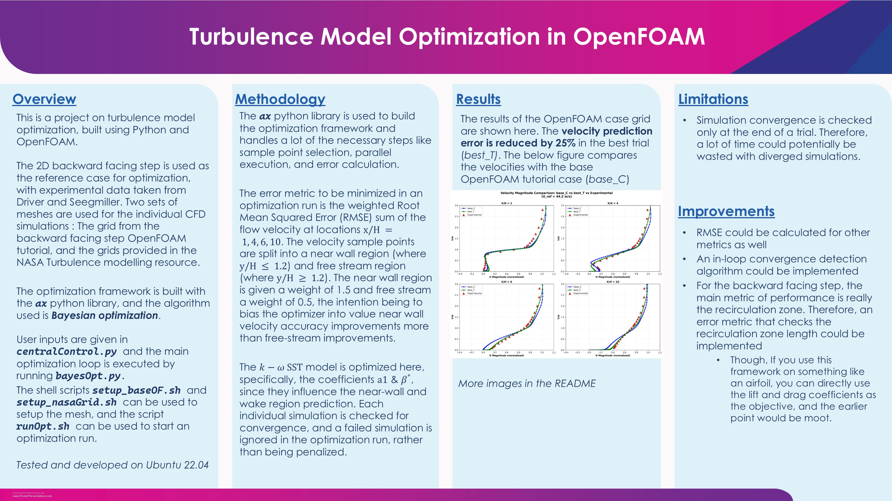
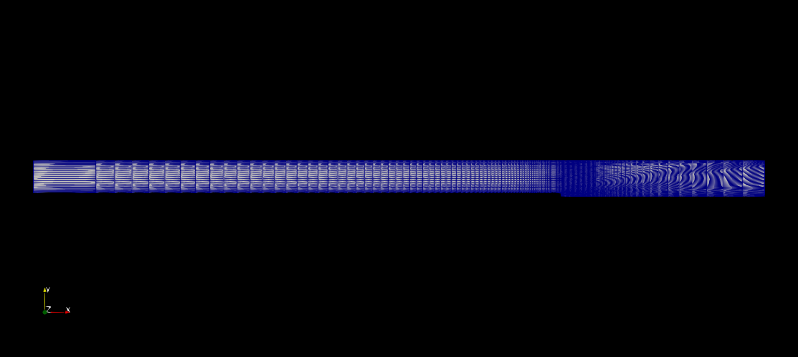
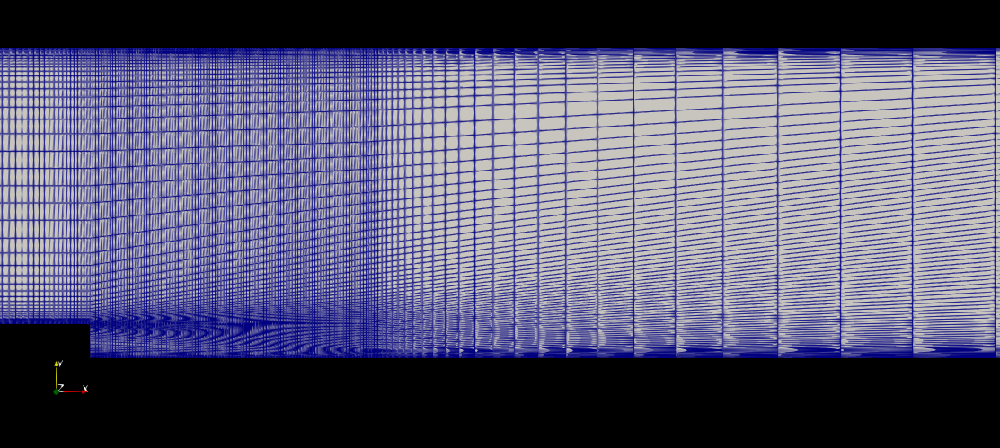
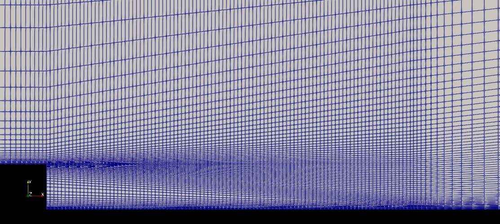
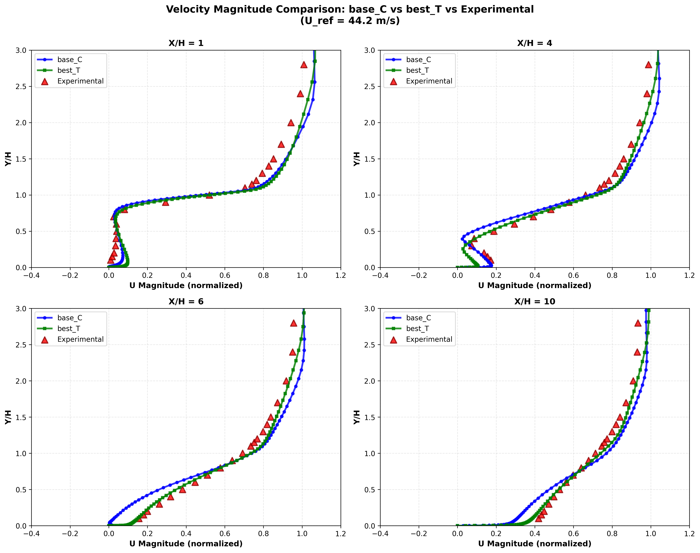

# Introduction

This is the backward facing step tutorial from OpenFOAM. 
The case is based on 
    
    D.M. Driver and H.L. Seegmiller. Features of a reattaching turbulent shear
    layer in divergent channel flow. AIAA Journal, 23(2):163–171, 1985.

My goal here is to explore turbulence model optimization techniques and
to see if I can get as close experimental agreement with data provided at 

    https://turbmodels.larc.nasa.gov/backstep_val.html

The point of this is to learn about optimization and correlation improvement.

## Usage

To use the framework, setup a grid with either `setup_baseOF.sh` or `setup_nasaGrid.sh` and then use the `runOpt.sh` script. User inputs are to be given in `centralControl.py`.

Make sure your main ~/.bashrc file sources the openfoam environment. Otherwise you will not be able to run pyFoam scripts in ax.

## Summary

Sample data of the runs mentioned in the summary are available in `ax_result_data/SampleResults`

base_OF Grid - 

Comparison of velocities measured at $x/H = 1, 4, 6, 10$. *base_C* => Case with base $k - \omega\, \text{SST}$ model coefficients , *best_T* => Best trial with optimized coefficients

I'd like to add a short discussion of the velocity comparison graph.

Looking at the subplots, we see that the optimisation has traded some fitness
in the recirculation near wall region (x/H = 1,4) for better fit in the reattached region (x/H =
6, 10). This is the exact opposite behaviour I had expected, as I thought that by weighting the near wall
region more, I’d get better fit in the recirculation zone.

But, in a way, I think this behavior is kind of expected. We see in x/H of 6, 10 that the near
wall (up to y/H of 1.2) velocity profile fits very well to the experimental data. My guess is that
the optimiser saw that by getting a better fit in x/H of 6, 10 regions, it could reduce the error a
lot, and so it might have focused on coefficients that facilitated this behaviour. Maybe if I had
specifically assigned an error weight to the recirculation zone, I could have achieved a better fit
in that region.